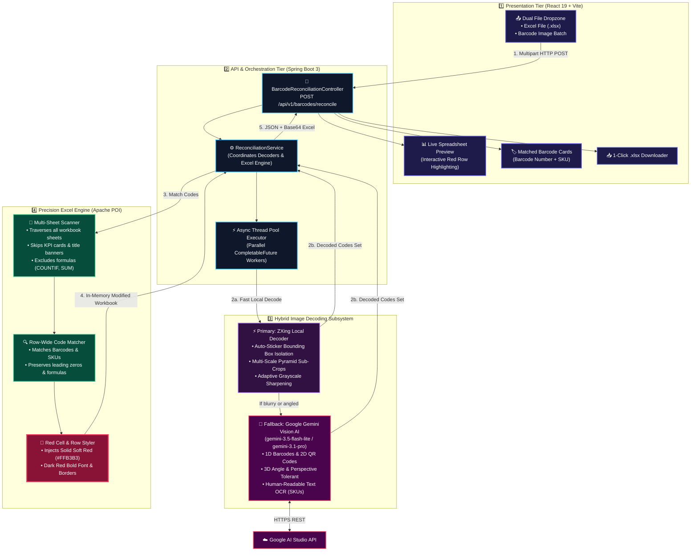

# 📦 Excel Barcode & QR Code Reconciler with Gemini AI

An enterprise-grade, full-stack web application designed to reconcile batches of warehouse barcode and QR code product photos against multi-sheet Excel inventory spreadsheets. Matched items are highlighted in **RED** and exported back into a modified `.xlsx` workbook with live preview and analytics.

---

## 🏗️ System Architecture

The system follows a clean, 4-tier pipeline architecture designed for high throughput, zero data loss, and complete accuracy:



---

## 🔍 Detailed Architecture Walkthrough

### 1. Presentation Tier (React 19 + Tailwind CSS)
* **Dual Upload Zone**: Handles simultaneous drag-and-drop of Excel files (`.xlsx`) and high-resolution camera photos.
* **Streamlined UI**: Automatically focuses on **matched results**—unmatched items are left unflagged and noise-free.
* **Interactive Spreadsheet Preview**: Displays the top 100 rows with real-time **`MATCH (RED)`** badges.
* **Direct Base64 Downloader**: Converts server-generated binary streams directly into clean `.xlsx` downloads without temporary file leaks.

---

### 2. API & Concurrency Tier (Spring Boot 3 + Java 17/21)
* **Stateless Stream Processing**: 100% in-memory execution—no database required, preserving user privacy.
* **Async Thread Pool (`CompletableFuture`)**: Decodes batches of 20–50+ images in parallel across available CPU cores.
* **Auto `.env` Loader**: Dynamically loads `GEMINI_API_KEY` and configuration settings from the project root on boot.

---

### 3. Hybrid Image Decoding Subsystem
* **Phase 1: Local ZXing Engine (Offline & Fast)**:
  - **Auto-Sticker Isolation**: Detects bright/white rectangular label regions from noisy camera scenes (e.g. boxes on workbenches).
  - **Multi-Scale Crops**: Evaluates center (80%, 60%) and quadrant sub-regions.
  - **Contrast Normalization**: Performs histogram stretching and 4-way rotation sweeps (0°, 90°, 180°, 270°).
* **Phase 2: Gemini 3.5 / 3.1 Vision AI (Intelligent Fallback)**:
  - Triggered automatically when traditional computer vision fails on 3D perspective tilt, reflections, or distorted labels.
  - Extracts both **1D Barcode numbers** (`840192837465`), **QR Codes**, and **SKU numbers** (`TL-9042-X`).

---

### 4. Precision Excel Highlighting Subsystem (Apache POI)
* **Multi-Sheet Traversal**: Scans all sheets in the workbook (e.g. `Item Barcode Catalog` and `Summary Dashboard`).
* **Formula & Banner Filtering**: Ignores top title banners and formula cells (such as `=COUNTIF('Item Barcode Catalog'!...)`) to lock onto the actual data table.
* **Row-Wide Matching**: Automatically checks if a decoded barcode or SKU appears anywhere in the row.
* **Universal Color Palette**: Applies **Vivid Soft Red (`#FFB3B3`)** with dark red bold font and borders, rendering identically across **Microsoft Excel, Apple Numbers, LibreOffice, and Google Sheets**.

---

## 🔄 End-to-End Sequence Diagram

```mermaid
sequenceDiagram
    autonumber
    actor User as 👤 Warehouse User
    participant FE as 🖥️ React Frontend
    participant API as ⚡ Spring Boot Controller
    participant Dec as ⚙️ Parallel Decoder Pool
    participant AI as 🧠 Gemini Vision AI
    participant XLS as 📊 Apache POI Engine

    User->>FE: Drop inventory.xlsx + Product photos
    User->>FE: Click "Start Reconcile & Highlight"
    FE->>API: POST /api/v1/barcodes/reconcile (Multipart)
    
    rect rgb(30, 27, 75)
        note over API,Dec: Parallel Image Decoding Phase
        API->>Dec: Dispatch image batch across worker threads
        par Local Processing
            Dec->>Dec: Auto-crop white label stickers & enhance contrast
            Dec->>Dec: Attempt fast offline ZXing decoding
        and AI Vision Fallback (if needed)
            Dec->>AI: Send image to Gemini Vision (gemini-3.5-flash-lite)
            AI-->>Dec: Return extracted barcodes & SKUs (JSON)
        end
        Dec-->>API: Return decoded codes set: [840192837465, 719283049581]
    end

    rect rgb(6, 78, 59)
        note over API,XLS: Spreadsheet Matching & Highlighting Phase
        API->>XLS: Scan workbook across all sheets
        XLS->>XLS: Filter out top title banners & formula rows
        XLS->>XLS: Identify data tables (Item Barcode Catalog, etc.)
        XLS->>XLS: Match codes against Barcode and SKU columns
        XLS->>XLS: Apply Vivid Red (#FFB3B3) style to matched cells/rows
        XLS-->>API: Return modified Excel bytes + preview data
    end

    API-->>FE: Return ReconciliationResponse (JSON + Base64 Excel)
    FE->>User: Display summary metrics, red table preview, and matched cards
    User->>FE: Click "Download Highlighted Excel"
    FE->>User: Save modified inventory_highlighted.xlsx
```



---

## 📁 Project Structure

```
Excel-Decoding-project/
├── .env                       # Root environment configuration (Gemini API Key)
├── backend/                   # Spring Boot 3 (Java 17/21) Backend
│   ├── .env                   # Backend environment configuration
│   ├── pom.xml                # Maven dependencies (Spring Boot, POI, ZXing, Jackson)
│   ├── src/main/java/com/excel/reconciler/
│   │   ├── ExcelReconcilerApplication.java # Entrypoint with automatic .env loader
│   │   ├── config/            # Async thread pools & CORS configuration
│   │   ├── controller/        # REST API endpoints (/api/v1/barcodes/reconcile)
│   │   ├── service/           # ZXingDecoderService, GeminiVisionService,
│   │   │                      # ExcelHighlightService, ReconciliationService
│   │   └── model/             # BarcodeResult, ExcelRowPreview, ReconciliationResponse
│   └── src/main/resources/
│       └── application.yml    # Multipart file limits & model bindings
│
├── frontend/                  # React 19 + Vite + Tailwind CSS Frontend
│   ├── package.json           # Dependencies (React, Lucide, Tailwind, Canvas-Confetti)
│   ├── vite.config.ts         # Vite server proxy configuration
│   └── src/
│       ├── components/        # FileUploadZone, ExcelPreviewTable, ImageScanGrid,
│       │                      # ReconciliationStats, Header
│       ├── services/api.ts    # Multipart upload client & Excel downloader
│       ├── types/index.ts     # TypeScript data contracts
│       └── App.tsx            # Main Application View
│
└── sample-data/               # Pre-configured test files
    ├── sample_inventory.xlsx  # Multi-sheet inventory spreadsheet
    └── images/                # Sample 1D and 2D barcode box photos
```

---

## ⚙️ Environment Configuration

Set your Google AI Studio API key in `.env`:

```env
# Google AI Studio API Key for multimodal barcode/SKU detection
# Get your free key at: https://aistudio.google.com/app/apikey.

# Default Gemini Vision Model
GEMINI_API_MODEL=gemini-3.5-flash-lite
```

---

## 🚀 Quick Start Guide

### Prerequisites
- **Java 17+** (OpenJDK recommended)
- **Maven 3.8+**
- **Node.js 18+** & **npm**

---

### Step 1: Start Backend (Spring Boot)

```bash
cd backend
mvn spring-boot:run
```
*Backend starts at `http://localhost:8080` and loads `.env` automatically.*

---

### Step 2: Start Frontend (React + Vite)

```bash
cd frontend
npm install
npm run dev
```
*Open `http://localhost:5173` in your browser.*

---

### Step 3: Reconcile Barcodes & Excel
1. Drop your `.xlsx` spreadsheet into **Step 1: Excel Spreadsheet**.
2. Drop your product photos into **Step 2: Barcode / QR Images**.
3. Click **"Start Reconcile & Highlight"**.
4. View your matched items in red on the spreadsheet preview and click **"Download Highlighted Excel"**!

---

## 🧪 Automated Testing

Run the automated backend test suite:

```bash
cd backend
mvn test
```
