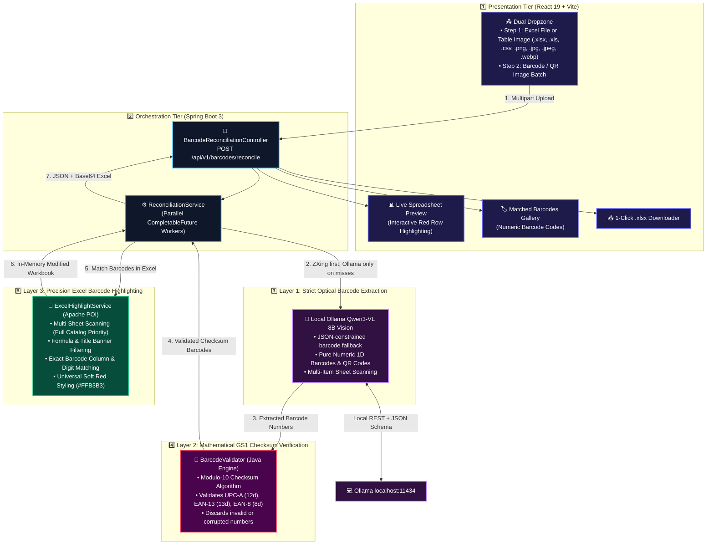

# 📦 Excel Barcode & QR Code Reconciler with Local Ollama AI

An enterprise-grade, full-stack web application designed to reconcile batches of warehouse barcode and QR code product photos against multi-sheet Excel inventory spreadsheets. Matched items are highlighted in **RED** and exported back into a modified `.xlsx` workbook with live preview, analytics, and a Khmer-only UI.

---

## 🏗️ 3-Layer Intelligent System Architecture

The application employs a **3-Layer Precision Barcode Pipeline** focused strictly on universal optical barcode numbers (UPC, EAN, Code 128, QR) combined with mathematical GS1 checksum verification and spreadsheet reconciliation.



---

## 🔍 How the Barcode-Focused Pipeline Works

### 🧠 Layer 1: Pure Barcode Number Extraction
* **Focus**: Strictly captures the **universal numeric barcode numbers** (`840192837401`) and QR code data.
* **Why**: Product names and Item IDs can vary or be formatted differently across companies, but the **Barcode Number is globally unique and standardized**.
* **Capability**: Automatically reads single product boxes **AND** multi-barcode sheets (e.g. Items #01 to #05 on a single verification sheet).

---

### 📐 Layer 2: Mathematical GS1 Modulo-10 Checksum Verification
* **How It Works**: Every extracted 12-digit (UPC-A) and 13-digit (EAN-13) barcode is mathematically validated against the official GS1 Modulo-10 check digit formula:
  $$\text{Check Digit} = (10 - ((d_1 + d_3 + d_5 + d_7 + d_9 + d_{11}) \times 3 + (d_2 + d_4 + d_6 + d_8 + d_{10})) \pmod{10}) \pmod{10}$$

---

### 📑 Layer 3: Excel Barcode Column Matching & Styling
* **How It Works**:
  1. **Smart Sheet Prioritization**: Targets the main catalog sheet with all item rows.
  2. **Banner & Formula Exclusion**: Ignores formulas (`=COUNTIF(...)`, `=SUM(...)`) and merged title banners.
  3. **Exact Barcode Matching**: Searches for the extracted barcode numbers within the spreadsheet.
  4. **Universal Styling**: Applies **Vivid Soft Red (`#FFB3B3`)** with dark red bold text compatible across **Microsoft Excel, Apple Numbers, LibreOffice, and Google Sheets**.

---

## 📁 Project Structure

```
Excel-Decoding-project/
├── .env                       # Root environment configuration (Ollama model)
├── backend/                   # Spring Boot 3 (Java 17/21) Backend
│   ├── .env                   # Backend environment configuration
│   ├── pom.xml                # Maven dependencies (Spring Boot, POI, ZXing, Jackson)
│   ├── src/main/java/com/excel/reconciler/
│   │   ├── ExcelReconcilerApplication.java # Entrypoint with automatic .env loader
│   │   ├── config/            # Async thread pools & CORS configuration
│   │   ├── controller/        # REST API endpoints (/api/v1/barcodes/reconcile)
│   │   ├── service/           # OllamaVisionService, ZXingDecoderService,
│   │   │                      # ExcelImageExtractorService, ExcelHighlightService,
│   │   │                      # ReconciliationService
│   │   ├── util/              # BarcodeValidator (GS1 Modulo-10 Checksum)
│   │   └── model/             # BarcodeResult, ExcelRowPreview, ReconciliationResponse
│   └── src/main/resources/
│       └── application.yml    # Multipart file limits & model bindings
│
├── frontend/                  # React 19 + Vite + Tailwind CSS Frontend
│   ├── package.json           # Dependencies (React, Lucide, Tailwind, Canvas-Confetti)
│   ├── vite.config.ts         # Vite server proxy configuration
│   └── src/
│       ├── app/                # Application composition and shell UI
│       │   ├── App.tsx         # Main application view
│       │   └── components/
│       │       └── AppHeader.tsx
│       ├── features/
│       │   └── reconciliation/
│       │       ├── api/        # Multipart upload client and Excel downloader
│       │       ├── components/ # Upload, preview, stats, and scan result UI
│       │       └── model/      # Reconciliation types and upload validation
│       ├── shared/
│       │   └── i18n/           # Khmer-only provider and translations
│       ├── styles/index.css    # Global Tailwind/base styles
│       └── main.tsx            # React entrypoint
│
└── sample-data/               # Pre-configured test files
    ├── sample_inventory.xlsx  # Multi-sheet inventory spreadsheet
    └── images/                # Sample 1D and 2D barcode box photos
```

---

## ⚙️ Environment Configuration

Configure the local Ollama model in `.env`:

```env
# Local Ollama vision model
OLLAMA_API_MODEL=qwen3-vl:8b-instruct
OLLAMA_API_URL=http://localhost:11434/api/chat
```

---

## 🚀 Quick Start Guide

### Prerequisites
- **Java 17+** (OpenJDK recommended)
- **Maven 3.8+**
- **Node.js 18+** & **npm**
- **Ollama** with `qwen3-vl:8b-instruct` downloaded

---

### Step 1: Start Backend (Spring Boot)

```bash
cd backend
mvn spring-boot:run
```
*Backend starts at `http://localhost:8080` and loads `.env` automatically.*

---

### Step 2: Start Frontend (React + Vite)

```bash
cd frontend
npm install
npm run dev
```
*Open `http://localhost:5173` in your browser.*

---

### Step 3: Reconcile Barcodes & Excel
1. Drop your `.xlsx`, `.xls`, or `.csv` spreadsheet, or a `.png`, `.jpg`, `.jpeg`, or `.webp` image of an Excel table, into **Step 1**.
2. Drop your product photos or multi-barcode sheets into **Step 2: Barcode / QR Images**.
3. Click **"Start Reconcile & Highlight"**.
4. View your matched items in red on the spreadsheet preview and click **"Download Highlighted Excel"**!

---

## 🧪 Automated Testing

Run the automated backend test suite:

```bash
cd backend
mvn test
```

Run the frontend build and focused upload/localization checks:

```bash
cd frontend
npm run build
node --experimental-strip-types --test tests/fileValidation.test.ts tests/i18n.test.ts
```
